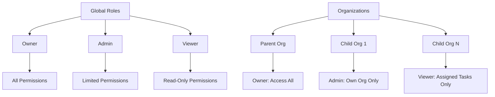
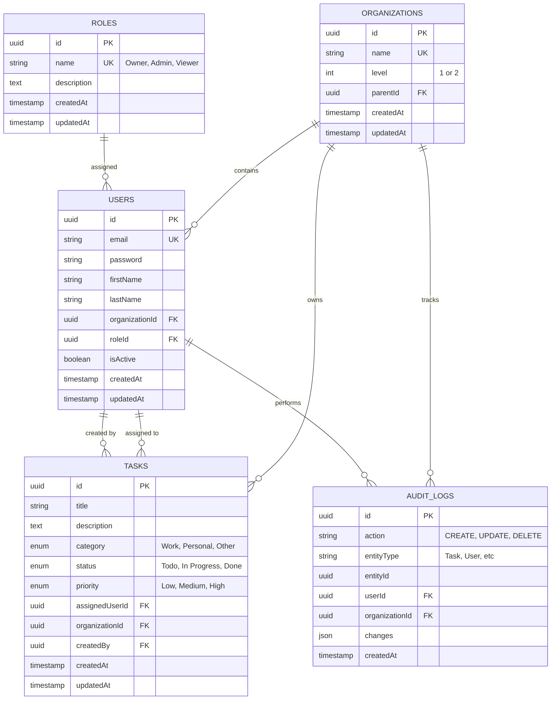

# 🔐 Secure Task Management System

A comprehensive **Role-Based Access Control (RBAC)** task management system built with **NestJS**, **Angular**, and **NX monorepo**. This enterprise-grade application demonstrates advanced security patterns, user management, hierarchical organization structure, and cross-organizational task management capabilities.

## ✨ Complete Feature Overview

### 🛡️ **Global Role-Based Access Control (RBAC)**

- **Global Role System**: Single set of roles (Owner, Admin, Viewer) used across all organizations
- **Hierarchical Permissions**: Fine-grained permission system with over 15 specific permissions
- **Cross-Organization Management**: Owners can manage tasks and users across child organizations
- **Role-Based UI Restrictions**: Interface adapts based on user permissions (viewers don't see org tabs)

### 🏢 **Multi-Level Organization Hierarchy**

- **2-Level Structure**: Parent organizations (Level 1) and child organizations (Level 2)
- **Hierarchical Access Control**: Parent org users can access child org data, but not vice versa
- **Organization Isolation**: Admins in parent orgs cannot see parent org data, only child orgs
- **Smart Organization Management**: Only Owners can create/update/delete organizations

### 👥 **Advanced User Management**

- **Comprehensive User Lifecycle**: Create, read, update, delete with role-based restrictions
- **Cross-Organization User Assignment**: Owners can assign tasks to users in child organizations
- **Secure Password Management**: bcrypt hashing, password change workflows, admin password resets
- **Profile Management**: Self-service profile updates with validation
- **User Status Control**: Active/inactive user management

### 📋 **Intelligent Task Management**

- **Role-Based Task Access**:
  - Viewers: Only their assigned tasks
  - Admins: All tasks in their accessible organizations
  - Owners: All tasks across parent and child organizations
- **Cross-Organization Task Creation**: Owners can create and assign tasks across organizational boundaries
- **Smart Task Assignment**: Prevents invalid cross-organization assignments except for authorized users
- **Task Filtering & Search**: Advanced filtering by status, priority, category, assignee

### 🔐 **Enterprise-Grade Security**

- **JWT Authentication**: Secure token-based authentication with expiration management
- **Permission-Based Route Guards**: API endpoints protected by granular permissions
- **Organization-Level Data Isolation**: Automatic filtering ensures users only access authorized data
- **Audit Trail System**: Complete logging of all CRUD operations with user attribution
- **Password Security**: Secure hashing, complexity requirements, change validation

### 🎨 **Dynamic Role-Based Interface**

- **Adaptive Navigation**: Menu items shown/hidden based on user permissions
- **Conditional UI Elements**: Buttons and actions appear only when user has required permissions
- **Organization Context Display**: Clear indication of current organization and accessible child orgs
- **Smart Form Validation**: Role-based form restrictions and validation rules

## 🎯 **Role Capabilities Matrix**


| Permission Category       | Owner        | Admin              | Viewer                  |
| ------------------------- | ------------ | ------------------ | ----------------------- |
| **Task Management**       |              |                    |                         |
| Create tasks              | ✅ Any org   | ✅ Own org         | ❌                      |
| View tasks                | ✅ All orgs  | ✅ Accessible orgs | ✅ Own Org. tasks only |
| Update/Delete tasks       | ✅ All orgs  | ✅ Accessible orgs | ❌                      |
| Assign tasks to others    | ✅ Cross-org | ✅ Same org        | ❌                      |
| **User Management**       |              |                    |                         |
| Create users              | ✅           | ✅                 | ❌                      |
| View user list            | ✅           | ✅                 | ❌                      |
| Update user details       | ✅           | ✅                 | ❌                      |
| Delete users              | ✅           | ❌                 | ❌                      |
| Reset passwords           | ✅           | ❌                 | ❌                      |
| Assign roles              | ✅           | ✅ (non-Owner)     | ❌                      |
| **Organization**          |              |                    |                         |
| View organization tabs    | ✅           | ✅                 | ❌                      |
| Access parent org data    | ✅           | ❌                 | ❌                      |
| Create/update/delete orgs | ✅           | ❌                 | ❌                      |
| **Profile & Account**     |              |                    |                         |
| View own profile          | ✅           | ✅                 | ✅                      |
| Update own profile        | ✅           | ✅                 | ✅                      |
| Change own password       | ✅           | ✅                 | ✅                      |
| **Audit & Security**      |              |                    |                         |
| View audit logs           | ✅           | ✅                 | ❌                      |

## 🏗️ **Organization Hierarchy Implementation**

### **Access Pattern Examples**

```typescript
// Parent Organization Owner
- Can create tasks in "Acme Corp" and assign to child org users
- Can view tasks from all child organizations 
- Can manage users across all organizations in hierarchy
- Can create new child organizations

// Child Organization Admin  
- Cannot see parent organization data
- Can manage all tasks in own organization
- Can create/manage users in own organization only
- Cannot access sibling organization data

// Viewer (Any Organization)
- No organization tabs visible in UI
- Can only see own assigned tasks
- Can update own profile and change password
- No management capabilities
```

### **Smart Cross-Organization Assignment**

```typescript
// Task Assignment Logic
if (user.roleName === 'Owner') {
  // Owners can assign tasks across organizational boundaries
  const accessibleOrgs = await this.getAccessibleOrgIds(user);
  // Validates assignment target is in accessible organizations
} else {
  // Admins/Viewers restricted to same organization
  if (assigneeOrg !== user.organizationId) {
    throw new ForbiddenException('Cannot assign cross-organization tasks');
  }
}
```

## 🔐 **Advanced Permission System**

### **Global Role Permissions**

```typescript
export const ROLE_PERMISSIONS = {
  Owner: [
    'task:create', 'task:read', 'task:update', 'task:delete',
    'task:read:all', 'task:assign', 'task:cross_org_assign',
    'user:create', 'user:read', 'user:update', 'user:delete', 
    'user:change_password', 'role:read', 'role:assign',
    'org:read', 'org:update', 'audit:read'
  ],
  Admin: [
    'task:create', 'task:read', 'task:update', 'task:delete',
    'task:read:all', 'task:assign',
    'user:create', 'user:read', 'user:update', 
    'role:read', 'role:assign', 'org:read'
  ],
  Viewer: [
    'task:read', 'user:read', 'profile:read', 'profile:update'
  ]
};
```

### **Permission-Based Route Protection**

```typescript
@Get('users')
@UseGuards(AuthGuard('jwt'), RbacGuard)
@Permissions('user:read')
async findAllInOrganization(@CurrentUser() user: AuthContext['user']) {
  return this.userService.findAllInOrganization(user);
}
```

### **Frontend Role-Based UI Restrictions**

```typescript
// Dynamic navigation based on permissions
<nav *ngIf="canViewOrganizations()">
  <a [routerLink]="['/organizations']">Organizations</a>
</nav>

canViewOrganizations(): boolean {
  return this.currentUser.roleName !== 'Viewer';
}

// Task assignment restrictions
canAssignToUser(targetUser: User): boolean {
  if (this.currentUser.roleName === 'Owner') return true;
  if (this.currentUser.roleName === 'Admin') {
    return targetUser.organizationId === this.currentUser.organizationId;
  }
  return targetUser.id === this.currentUser.id; // Viewer
}
```

## 🚀 **Quick Start Guide**

### **Prerequisites**

- Node.js 18+
- npm 8+

### **Installation**

```bash
git clone https://github.com/Nabin99/secure-tms.git
cd secure-tms
npm install

# Set up environment
cp .env.example .env
# Edit .env with your JWT secret

# Start development servers
npx nx serve api &
npx nx serve dashboard
```

### **Access URLs**

- **Frontend Dashboard**: http://localhost:4200
- **Backend API**: http://localhost:3000
- **API Documentation**: http://localhost:3000/api (when implemented)

### **Demo Accounts**

The system includes pre-configured demo accounts for testing:


| Organization            | Role   | Email                 | Password      | Description                               |
| ----------------------- | ------ | --------------------- | ------------- | ----------------------------------------- |
| **Secure TMS** (Parent) | Owner  | `owner@test.com`      | `password123` | Full system access, can manage child orgs |
| **Secure TMS** (Parent) | Admin  | `admin@test.com`      | `password123` | Admin access to parent org only           |
| **Secure TMS** (Parent) | Viewer | `viewer@test.com`     | `password123` | Limited to assigned tasks                 |
| **Engineering** (Child) | Admin  | `eng.admin@test.com`  | `password123` | Admin access to Engineering org           |
| **Engineering** (Child) | Viewer | `eng.viewer@test.com` | `password123` | Viewer in Engineering org                 |

### **Testing Role-Based Features**

1. **Login as Owner** → Access all features, create cross-org tasks
2. **Switch to Admin** → Limited to own org, no parent org access
3. **Switch to Viewer** → No organization tabs, own tasks only
4. **Create Test Task** as Owner → Assign to child org user
5. **Verify Isolation** → Child org users cannot see parent tasks

## 🏗️ **System Architecture**

### **NX Monorepo Structure**

```
secure-tms/
├── apps/
│   ├── api/                    # NestJS Backend API
│   │   ├── src/
│   │   │   ├── auth/          # JWT authentication, permissions guard
│   │   │   ├── users/         # User CRUD, profile management
│   │   │   ├── tasks/         # Task management with cross-org support
│   │   │   ├── organizations/ # Organization hierarchy management
│   │   │   ├── roles/         # Global role management
│   │   │   ├── audit/         # Comprehensive audit logging
│   │   │   └── entities/      # TypeORM entities (User, Task, Role, Org)
│   ├── dashboard/             # Angular Frontend Dashboard
│   │   ├── src/app/
│   │   │   ├── auth/         # Authentication service, guards
│   │   │   ├── users/        # User management interface
│   │   │   ├── tasks/        # Task management interface
│   │   │   ├── profile/      # User profile management
│   │   │   └── shared/       # Shared components, services
│   └── api-e2e/              # End-to-end tests
├── libs/
│   ├── auth/                  # Shared authentication library
│   │   └── src/lib/auth.ts   # Global ROLE_PERMISSIONS mapping
│   └── data/                  # Shared DTOs and interfaces
│       └── src/lib/data.ts   # User, Task, Role interfaces
└── tmp/                       # Development SQLite database
```

### **Global Role System Architecture**



### **Technology Stack**

- **Backend Framework**: NestJS 11.0.0 with TypeORM
- **Frontend Framework**: Angular 20.2.0 with Standalone Components
- **Database**: SQLite (dev) / PostgreSQL (production)
- **Authentication**: JWT with bcrypt password hashing
- **Monorepo Management**: NX 21.5.3
- **Testing**: Jest (backend) + Karma/Jasmine (frontend)
- **Styling**: Tailwind CSS for modern, responsive UI

### **Shared Libraries Benefits**

- **@secure-tms/auth**: Centralized RBAC logic, permission definitions
- **@secure-tms/data**: Type-safe DTOs shared between frontend/backend
- **Type Safety**: Complete end-to-end type safety with shared interfaces
- **Code Reuse**: Single source of truth for permissions and data structures

## 🚀 Quick Setup Instructions

### Prerequisites

- Node.js 18+
- npm 8+

### Installation & Development

```bash
# Clone and install dependencies
git clone https://github.com/Nabin99/secure-tms.git
cd secure-tms
npm install

# Set up environment variables
cp .env.example .env
# Edit .env with your configuration

# Run both applications concurrently
npx nx serve api &
npx nx serve dashboard

# Or run separately:
npx nx serve api        # Backend on http://localhost:3000
npx nx serve dashboard  # Frontend on http://localhost:4200
```

### Test Credentials

The application comes with seeded test accounts for different roles:


| Role           | Email                 | Password      | Description                                  |
| -------------- | --------------------- | ------------- | -------------------------------------------- |
| **Owner**      | `owner@test.com`      | `password123` | Full system access including user management |
| **Admin**      | `admin@test.com`      | `password123` | Administrative access, user management       |
| **Viewer**     | `viewer@test.com`     | `password123` | Read-only access to tasks and users          |
| **Eng Admin**  | `eng.admin@test.com`  | `password123` | Admin role in Engineering organization       |
| **Eng Viewer** | `eng.viewer@test.com` | `password123` | Viewer role in Engineering organization      |

> **Security Note**: These are development-only credentials. The database is automatically seeded on first run of the API server.

### Environment Configuration (.env)

```env
# JWT Configuration
JWT_SECRET=your-super-secret-jwt-key-here
JWT_EXPIRES_IN=24h

# Database Configuration  
DB_TYPE=sqlite
DB_DATABASE=tmp/dev.sqlite

# For production PostgreSQL:
# DB_TYPE=postgres
# DB_HOST=localhost
# DB_PORT=5432
# DB_USERNAME=your-username
# DB_PASSWORD=your-password
# DB_DATABASE=secure_tms

# Application Settings
API_PORT=3000
NODE_ENV=development
```

## 📊 **Database Schema & Data Model**

### **Entity Relationship Overview**



### **Global Role Entity**

```typescript
// apps/api/src/entities/role.entity.ts
@Entity('roles')
export class Role {
  @PrimaryGeneratedColumn('uuid')
  id: string;

  @Column({ unique: true })
  name: 'Owner' | 'Admin' | 'Viewer';

  @Column({ type: 'text', nullable: true })
  description: string;

  @OneToMany(() => User, user => user.role)
  users: User[];
  
  // No organizationId - roles are global!
}
```

### **Organization Hierarchy Implementation**

```typescript
// apps/api/src/entities/organization.entity.ts
@Entity('organizations')
export class Organization {
  @PrimaryGeneratedColumn('uuid')
  id: string;

  @Column({ unique: true })
  name: string;

  @Column({ type: 'int', default: 1 })
  level: 1 | 2; // 1 = Parent, 2 = Child

  @Column({ type: 'uuid', nullable: true })
  parentId: string;

  @ManyToOne(() => Organization, { nullable: true })
  @JoinColumn({ name: 'parentId' })
  parent: Organization;

  @OneToMany(() => Organization, org => org.parent)
  children: Organization[];
}
```

## 🔐 **Comprehensive Access Control Implementation**

### **Cross-Organization Task Management**

```typescript
// apps/api/src/tasks/task.service.ts - Key Implementation
async getAccessibleOrgIds(user: AuthContext['user']): Promise<string[]> {
  const userOrg = await this.orgRepository.findOne({
    where: { id: user.organizationId },
    relations: ['children']
  });

  if (!userOrg) return [user.organizationId];

  if (user.roleName === 'Owner') {
    // Owners can access their org + all child organizations
    if (userOrg.level === 1) {
      return [userOrg.id, ...userOrg.children.map(child => child.id)];
    }
  } else if (user.roleName === 'Admin') {
    // Admins in parent orgs can only access child orgs (NOT parent data)
    if (userOrg.level === 1) {
      return userOrg.children.map(child => child.id);
    }
  }
  
  // Default: own organization only
  return [user.organizationId];
}

async create(createTaskDto: CreateTaskDto, user: AuthContext['user']) {
  // Cross-organization assignment validation with Owner exceptions
  if (createTaskDto.assignedUserId) {
    const assignee = await this.userRepository.findOne({
      where: { id: createTaskDto.assignedUserId },
      relations: ['organization']
    });

    const accessibleOrgs = await this.getAccessibleOrgIds(user);
  
    if (!accessibleOrgs.includes(assignee.organizationId)) {
      // Special exception: Owners can assign to themselves across organizations
      if (user.roleName === 'Owner' && assignee.id === user.id) {
        console.log('Owner self-assignment across organizations allowed');
      } else {
        throw new ForbiddenException(
          `Cannot assign task to user in different organization`
        );
      }
    }
  }
}
```

### **Role-Based UI Restrictions**

```typescript
// apps/dashboard/src/app/shared/services/auth.service.ts
canViewOrganizations(): boolean {
  return this.currentUser?.roleName !== 'Viewer';
}

canAccessParentOrganization(): boolean {
  return this.currentUser?.roleName === 'Owner';
}

canManageUsers(): boolean {
  return ['Owner', 'Admin'].includes(this.currentUser?.roleName);
}

canDeleteUsers(): boolean {
  return this.currentUser?.roleName === 'Owner';
}

canCreateOrganizations(): boolean {
  return this.currentUser?.roleName === 'Owner';
}
```

### **Organization Hierarchy Access Control**

```typescript
// apps/api/src/organizations/organization.service.ts
async getAccessibleOrganizations(user: AuthContext['user']): Promise<Organization[]> {
  const userOrg = await this.organizationRepository.findOne({
    where: { id: user.organizationId },
    relations: ['children', 'parent']
  });

  if (!userOrg) return [];

  // Role-based organization access
  if (user.roleName === 'Owner') {
    if (userOrg.level === 1) {
      // Parent org Owners: access own org + children
      return [userOrg, ...userOrg.children];
    } else {
      // Child org Owners: access own org only
      return [userOrg];
    }
  } else if (user.roleName === 'Admin') {
    if (userOrg.level === 1) {
      // Parent org Admins: access children only (NOT parent)
      return userOrg.children;
    } else {
      // Child org Admins: access own org only
      return [userOrg];
    }
  } else {
    // Viewers: no organization access in UI
    return [];
  }
}
```

### **JWT Security Implementation**

```typescript
// apps/api/src/auth/jwt.strategy.ts - Enhanced Token Validation
async validate(payload: JwtPayload): Promise<AuthContext['user']> {
  const user = await this.userRepository.findOne({
    where: { id: payload.sub, isActive: true },
    relations: ['role', 'organization']
  });
  
  if (!user || !user.isActive) {
    throw new UnauthorizedException('User not found or inactive');
  }
  
  // Get user's permissions based on global role
  const permissions = ROLE_PERMISSIONS[user.role.name] || [];
  
  return {
    id: user.id,
    email: user.email,
    firstName: user.firstName,
    lastName: user.lastName,
    organizationId: user.organizationId,
    roleId: user.roleId,
    roleName: user.role.name,
    permissions,
    organizationLevel: user.organization.level
  };
}
```

## 📱 **Frontend User Interface Features**

### **Dynamic Navigation & UI Restrictions**

```typescript
// apps/dashboard/src/app/layout/navigation.component.ts
<nav class="space-y-1">
  <!-- Tasks - Available to all authenticated users -->
  <a routerLink="/tasks" class="nav-link">
    <svg class="nav-icon">...</svg>
    Tasks
  </a>

  <!-- Users - Admin+ only -->
  <a *ngIf="canManageUsers()" routerLink="/users" class="nav-link">
    <svg class="nav-icon">...</svg>
    Users
  </a>

  <!-- Organizations - Hidden from Viewers -->
  <a *ngIf="canViewOrganizations()" routerLink="/organizations" class="nav-link">
    <svg class="nav-icon">...</svg>
    Organizations
  </a>

  <!-- Audit Logs - Admin+ only -->
  <a *ngIf="canViewAuditLogs()" routerLink="/audit" class="nav-link">
    <svg class="nav-icon">...</svg>
    Audit Logs
  </a>
</nav>
```

### **User Management Interface**

```typescript
// apps/dashboard/src/app/users/user-management.component.ts
export class UserManagementComponent {
  // Dynamic action buttons based on permissions
  getAvailableActions(user: UserResponse): UserAction[] {
    const actions: UserAction[] = [
      { id: 'view', label: 'View', icon: 'eye' }
    ];

    if (this.canEditUser(user)) {
      actions.push({ id: 'edit', label: 'Edit', icon: 'pencil' });
    }

    if (this.canResetPassword(user)) {
      actions.push({ id: 'reset-password', label: 'Reset Password', icon: 'key' });
    }

    if (this.canDeleteUser(user)) {
      actions.push({ id: 'delete', label: 'Delete', icon: 'trash', danger: true });
    }

    return actions;
  }

  canEditUser(user: UserResponse): boolean {
    return (this.currentUser.roleName === 'Owner' || 
            this.currentUser.roleName === 'Admin') && 
           user.id !== this.currentUser.id;
  }

  canDeleteUser(user: UserResponse): boolean {
    return this.currentUser.roleName === 'Owner' && 
           user.id !== this.currentUser.id &&
           user.roleName !== 'Owner';
  }

  canResetPassword(user: UserResponse): boolean {
    return this.currentUser.roleName === 'Owner' && 
           user.id !== this.currentUser.id;
  }
}
```

### **Task Management with Cross-Organization Support**

```typescript
// apps/dashboard/src/app/tasks/task-list.component.ts
export class TaskListComponent {
  // Organization badge display for cross-org visibility
  getOrganizationBadge(task: Task): string | null {
    if (this.currentUser.roleName === 'Owner' && 
        this.currentUser.organizationLevel === 1) {
      // Show organization badges for parent org owners
      return task.organization?.name || 'Unknown';
    }
    return null; // No badges for other users
  }

  // User assignment dropdown with cross-org filtering
  getAssignableUsers(): User[] {
    if (this.currentUser.roleName === 'Owner') {
      // Owners can assign across accessible organizations
      return this.allAccessibleUsers;
    } else if (this.currentUser.roleName === 'Admin') {
      // Admins can assign within their organization
      return this.sameOrgUsers;
    } else {
      // Viewers can only assign to themselves
      return [this.currentUser];
    }
  }
}
```

### **Profile Management**

```typescript
// apps/dashboard/src/app/profile/profile.component.ts
export class ProfileComponent {
  // Secure password change with validation
  async changePassword(passwordForm: ChangePasswordForm) {
    try {
      await this.authService.changePassword({
        currentPassword: passwordForm.currentPassword,
        newPassword: passwordForm.newPassword
      });
    
      this.notificationService.success('Password changed successfully');
      this.passwordForm.reset();
    } catch (error) {
      if (error.status === 400) {
        this.notificationService.error('Current password is incorrect');
      } else {
        this.notificationService.error('Failed to change password');
      }
    }
  }

  // Profile update with validation
  async updateProfile(profileForm: UpdateProfileForm) {
    try {
      const updatedUser = await this.userService.updateProfile({
        firstName: profileForm.firstName,
        lastName: profileForm.lastName,
        email: profileForm.email
      });
    
      this.authService.updateCurrentUser(updatedUser);
      this.notificationService.success('Profile updated successfully');
    } catch (error) {
      this.notificationService.error('Failed to update profile');
    }
  }
}
```

## 🔌 **Comprehensive API Documentation**

### **Authentication Endpoints**

#### `POST /auth/login`

**Purpose**: Authenticate user and receive JWT token with role-based permissions

**Request Body**:

```json
{
  "email": "owner@test.com",
  "password": "password123"
}
```

**Response**:

```json
{
  "access_token": "eyJhbGciOiJIUzI1NiIsInR5cCI6IkpXVCJ9...",
  "user": {
    "id": "550e8400-e29b-41d4-a716-446655440000",
    "email": "owner@test.com",
    "firstName": "System",
    "lastName": "Owner",
    "roleName": "Owner",
    "organizationId": "org-uuid",
    "organizationName": "Secure TMS",
    "organizationLevel": 1,
    "permissions": ["task:create", "task:read", "task:update", "task:delete", "user:create", "user:read", "user:update", "user:delete", "org:read", "org:update", "audit:read"]
  }
}
```

### **Task Management Endpoints**

#### `GET /tasks` - Retrieve Tasks (Role-Based)

**Purpose**: Get tasks based on user role and organization access

**Query Parameters**:

- `status`: Filter by status ('Todo', 'In Progress', 'Done')
- `priority`: Filter by priority ('Low', 'Medium', 'High')
- `category`: Filter by category ('Work', 'Personal', 'Other')
- `search`: Search by title or description

**Role-Based Behavior**:

- **Owner (Parent Org)**: Returns all tasks from parent + child organizations
- **Admin (Parent Org)**: Returns tasks from child organizations only
- **Owner/Admin (Child Org)**: Returns tasks from own organization only
- **Viewer**: Returns only tasks assigned to the user

**Response**:

```json
[
  {
    "id": "task-uuid",
    "title": "Complete cross-org task management",
    "description": "Implement cross-organizational task assignment",
    "category": "Work",
    "status": "In Progress",
    "priority": "High",
    "assignedUserId": "user-uuid",
    "assignedUser": {
      "id": "user-uuid",
      "firstName": "Jane",
      "lastName": "Doe",
      "email": "jane@subsidiary.com",
      "organization": {
        "id": "child-org-uuid",
        "name": "Engineering Subsidiary"
      }
    },
    "organizationId": "child-org-uuid",
    "organization": {
      "id": "child-org-uuid", 
      "name": "Engineering Subsidiary",
      "level": 2
    },
    "createdBy": "owner-uuid",
    "createdAt": "2024-01-15T10:30:00Z",
    "updatedAt": "2024-01-16T14:20:00Z"
  }
]
```

#### `POST /tasks` - Create Task (Cross-Organization Support)

**Purpose**: Create new task with role-based assignment restrictions

**Request Body**:

```json
{
  "title": "New Cross-Org Task",
  "description": "Task description here",
  "category": "Work",
  "priority": "Medium",
  "assignedUserId": "user-in-child-org-uuid"
}
```

**Role-Based Behavior**:

- **Owner**: Can assign to users in accessible organizations (parent + children)
- **Admin**: Can assign to users in same organization only
- **Viewer**: Can only create tasks assigned to themselves

**Response**:

```json
{
  "id": "new-task-uuid",
  "title": "New Cross-Org Task",
  "description": "Task description here", 
  "category": "Work",
  "status": "Todo",
  "priority": "Medium",
  "assignedUserId": "user-in-child-org-uuid",
  "organizationId": "child-org-uuid",
  "createdBy": "current-user-uuid",
  "createdAt": "2024-01-17T09:15:00Z",
  "updatedAt": "2024-01-17T09:15:00Z"
}
```

### **User Management Endpoints**

#### `GET /users` - List Organization Users (Admin+ Only)

**Purpose**: Retrieve all users in accessible organizations

**Query Parameters**:

- `search`: Search by name or email
- `role`: Filter by role name ('Owner', 'Admin', 'Viewer')
- `isActive`: Filter by active status
- `organizationId`: Filter by specific organization (Owner only)

**Role-Based Access**:

- **Owner (Parent)**: Can see users from parent + child organizations
- **Admin**: Can see users from own organization only
- **Viewer**: Cannot access this endpoint

**Response**:

```json
[
  {
    "id": "user-uuid",
    "email": "john.doe@subsidiary.com",
    "firstName": "John", 
    "lastName": "Doe",
    "organizationId": "child-org-uuid",
    "roleId": "role-uuid",
    "roleName": "Admin",
    "isActive": true,
    "createdAt": "2024-01-15T10:30:00Z",
    "updatedAt": "2024-01-16T14:20:00Z",
    "organization": {
      "id": "child-org-uuid",
      "name": "Engineering Subsidiary",
      "level": 2
    },
    "role": {
      "id": "role-uuid",
      "name": "Admin",
      "description": "Can manage users and tasks"
    }
  }
]
```

#### `POST /users` - Create User (Admin+ Only)

**Purpose**: Create new user in organization

**Request Body**:

```json
{
  "email": "newuser@example.com",
  "password": "securePassword123",
  "firstName": "New",
  "lastName": "User",
  "roleId": "admin-role-uuid"
}
```

**Validation Rules**:

- Email must be unique across system
- Password minimum 6 characters
- Names minimum 2 characters each
- Role must exist and be assignable by current user

#### `PUT /users/:id` - Update User (Admin+ Only)

**Purpose**: Update user information with role-based restrictions

**Request Body**:

```json
{
  "firstName": "Updated",
  "lastName": "Name", 
  "email": "updated@example.com",
  "roleId": "new-role-uuid",
  "isActive": false
}
```

**Role Restrictions**:

- **Admin**: Cannot assign Owner role or update Owner users
- **Owner**: Full update capabilities

#### `DELETE /users/:id` - Delete User (Owner Only)

**Purpose**: Permanently delete user account

**Restrictions**:

- Cannot delete self
- Cannot delete other Owner users
- Only Owner role can perform deletions

#### `GET /users/me` - Get Current User Profile

**Purpose**: Retrieve current user's complete profile information

**Response**:

```json
{
  "id": "current-user-uuid",
  "email": "current@example.com",
  "firstName": "Current",
  "lastName": "User", 
  "organizationId": "org-uuid",
  "roleName": "Admin",
  "isActive": true,
  "organization": {
    "id": "org-uuid",
    "name": "Secure TMS",
    "level": 1
  },
  "role": {
    "id": "role-uuid",
    "name": "Admin", 
    "description": "Can manage users and tasks",
    "permissions": ["user:create", "user:read", "user:update", "task:create", "task:read", "task:update", "task:delete"]
  },
  "accessibleOrganizations": [
    {
      "id": "child-org-1-uuid",
      "name": "Engineering Subsidiary"
    },
    {
      "id": "child-org-2-uuid", 
      "name": "Marketing Subsidiary"
    }
  ]
}
```

#### `PUT /users/me` - Update Own Profile

**Purpose**: Update current user's profile information

**Request Body**:

```json
{
  "firstName": "Updated",
  "lastName": "Name",
  "email": "newemail@example.com"
}
```

#### `PUT /users/me/password` - Change Own Password

**Purpose**: Secure password change with current password verification

**Request Body**:

```json
{
  "currentPassword": "oldPassword123",
  "newPassword": "newSecurePassword456"
}
```

**Security Features**:

- Current password verification required
- New password complexity validation
- Password hashing with bcrypt
- JWT token remains valid after change

### **Organization Management Endpoints**

#### `GET /organizations` - List Accessible Organizations

**Purpose**: Get organizations based on user role and hierarchy access

**Role-Based Access**:

- **Owner (Parent)**: Parent organization + all children
- **Admin (Parent)**: Child organizations only (not parent)
- **Child Org Users**: Own organization only
- **Viewer**: Empty array (no org access)

**Response**:

```json
[
  {
    "id": "parent-org-uuid",
    "name": "Secure TMS",
    "level": 1,
    "parentId": null,
    "children": [
      {
        "id": "child-org-uuid",
        "name": "Engineering Subsidiary", 
        "level": 2,
        "parentId": "parent-org-uuid"
      }
    ],
    "userCount": 15,
    "taskCount": 42,
    "createdAt": "2024-01-01T00:00:00Z"
  }
]
```

#### `POST /organizations` - Create Organization (Owner Only)

**Purpose**: Create new child organization

**Request Body**:

```json
{
  "name": "New Subsidiary",
  "description": "New subsidiary organization"
}
```

**Restrictions**:

- Only Owner role can create organizations
- Creates Level 2 (child) organization under current user's org
- Organization names must be unique

### **Role Management Endpoints**

#### `GET /roles` - Get Available Roles (Admin+ Only)

**Purpose**: Retrieve all global roles available for assignment

**Response**:

```json
[
  {
    "id": "owner-role-uuid",
    "name": "Owner",
    "description": "Full system access with cross-organizational management",
    "permissions": ["*"],
    "createdAt": "2024-01-01T00:00:00Z"
  },
  {
    "id": "admin-role-uuid",
    "name": "Admin",
    "description": "Administrative access for user and task management",
    "permissions": ["task:create", "task:read", "task:update", "task:delete", "user:create", "user:read", "user:update"],
    "createdAt": "2024-01-01T00:00:00Z"
  },
  {
    "id": "viewer-role-uuid",
    "name": "Viewer", 
    "description": "Read-only access to assigned tasks and own profile",
    "permissions": ["task:read", "user:read", "profile:read", "profile:update"],
    "createdAt": "2024-01-01T00:00:00Z"
  }
]
```

### **Audit Trail Endpoints**

#### `GET /audit` - Retrieve Audit Logs (Admin+ Only)

**Purpose**: Get comprehensive audit trail of system activities

**Query Parameters**:

- `action`: Filter by action ('CREATE', 'UPDATE', 'DELETE')
- `entityType`: Filter by entity ('Task', 'User', 'Organization')
- `startDate` / `endDate`: Date range filtering
- `userId`: Filter by specific user actions
- `limit`: Number of records to return (default: 50)

**Response**:

```json
[
  {
    "id": "audit-log-uuid",
    "action": "CREATE",
    "entityType": "Task",
    "entityId": "task-uuid",
    "userId": "user-uuid",
    "organizationId": "org-uuid",
    "changes": {
      "title": "New Cross-Org Task",
      "assignedUserId": "user-in-child-org",
      "organizationId": "child-org-uuid"
    },
    "user": {
      "firstName": "John",
      "lastName": "Doe",
      "email": "john@example.com"
    },
    "createdAt": "2024-01-17T09:15:00Z"
  }
]
```

### **Error Handling**

All endpoints return consistent error responses:

```json
{
  "statusCode": 403,
  "message": "Cannot assign task to user in different organization", 
  "error": "Forbidden"
}
```

**Common HTTP Status Codes**:

- `200`: Success
- `201`: Created successfully
- `400`: Bad Request (validation errors)
- `401`: Unauthorized (authentication required)
- `403`: Forbidden (insufficient permissions)
- `404`: Not Found
- `500`: Internal Server Error

## 🧪 **Comprehensive Testing Strategy**

### **Backend Testing (Jest)**

```bash
# Run all API tests
npx nx test api

# Run specific test suites
npx nx test api --testNamePattern="RBAC"
npx nx test api --testNamePattern="Auth"
npx nx test api --testNamePattern="Cross-Organization"
npx nx test api --testNamePattern="User Management"

# Run with coverage
npx nx test api --coverage
```

**Key Test Categories**:

#### **RBAC & Permission Testing**
```typescript
// apps/api/src/auth/auth.service.spec.ts
describe('Role-Based Access Control', () => {
  it('should allow Owner to access all organizations', async () => {
    const owner = createMockUser('Owner', parentOrgId);
    const accessibleOrgs = await service.getAccessibleOrganizations(owner);
    expect(accessibleOrgs).toHaveLength(3); // Parent + 2 children
  });

  it('should restrict Admin to child organizations only', async () => {
    const admin = createMockUser('Admin', parentOrgId);
    const accessibleOrgs = await service.getAccessibleOrganizations(admin);
    expect(accessibleOrgs).toHaveLength(2); // Only children, not parent
  });

  it('should deny Viewer organization access', async () => {
    const viewer = createMockUser('Viewer', childOrgId);
    const accessibleOrgs = await service.getAccessibleOrganizations(viewer);
    expect(accessibleOrgs).toHaveLength(0);
  });
});
```

#### **Cross-Organization Task Management**
```typescript
// apps/api/src/tasks/task.service.spec.ts
describe('Cross-Organization Task Creation', () => {
  it('should allow Owner to assign tasks across organizations', async () => {
    const owner = createMockUser('Owner', parentOrgId);
    const childUser = createMockUser('Viewer', childOrgId);
    
    const task = await service.create({
      title: 'Cross-org task',
      assignedUserId: childUser.id
    }, owner);
    
    expect(task.assignedUserId).toBe(childUser.id);
    expect(task.organizationId).toBe(childOrgId);
  });

  it('should prevent Admin from cross-org assignment', async () => {
    const admin = createMockUser('Admin', parentOrgId);
    const childUser = createMockUser('Viewer', childOrgId);
    
    await expect(service.create({
      title: 'Cross-org task',
      assignedUserId: childUser.id
    }, admin)).rejects.toThrow('Cannot assign task to user in different organization');
  });
});
```

#### **User Management Security**
```typescript
// apps/api/src/users/user.service.spec.ts
describe('User Management Security', () => {
  it('should prevent Admin from deleting users', async () => {
    const admin = createMockUser('Admin', orgId);
    const targetUser = createMockUser('Viewer', orgId);
    
    await expect(service.remove(targetUser.id, admin))
      .rejects.toThrow('Insufficient permissions to delete user');
  });

  it('should allow Owner to reset user passwords', async () => {
    const owner = createMockUser('Owner', orgId);
    const targetUser = createMockUser('Admin', orgId);
    
    const result = await service.resetPassword(targetUser.id, 'newPassword', owner);
    expect(result.success).toBe(true);
  });
});
```

### **Frontend Testing (Jest/Karma)**

```bash
# Run dashboard tests
npx nx test dashboard

# Run with coverage
npx nx test dashboard --coverage

# Run specific component tests
npx nx test dashboard --testNamePattern="UserManagement"
npx nx test dashboard --testNamePattern="TaskList"
```

**Key Frontend Test Categories**:

#### **Role-Based UI Testing**
```typescript
// apps/dashboard/src/app/users/user-management.component.spec.ts
describe('UserManagementComponent Role Restrictions', () => {
  it('should hide delete button for Admin users', () => {
    component.currentUser = createMockUser('Admin');
    component.users = [createMockUser('Viewer')];
    fixture.detectChanges();
    
    const deleteButton = fixture.debugElement.query(By.css('[data-testid="delete-user"]'));
    expect(deleteButton).toBeNull();
  });

  it('should show organization badge for Owner in parent org', () => {
    component.currentUser = createMockUser('Owner', parentOrgId);
    component.tasks = [createMockTask(childOrgId)];
    fixture.detectChanges();
    
    const orgBadge = fixture.debugElement.query(By.css('[data-testid="org-badge"]'));
    expect(orgBadge.nativeElement.textContent).toContain('Engineering');
  });
});
```

#### **Navigation Guard Testing**
```typescript
// apps/dashboard/src/app/auth/guards/role.guard.spec.ts
describe('RoleGuard', () => {
  it('should allow Owner to access user management', () => {
    const owner = createMockUser('Owner');
    const canActivate = guard.canActivate(owner, '/users');
    expect(canActivate).toBe(true);
  });

  it('should redirect Viewer away from user management', () => {
    const viewer = createMockUser('Viewer');
    const canActivate = guard.canActivate(viewer, '/users');
    expect(canActivate).toBe(false);
  });
});
```

### **End-to-End Testing**

```bash
# Run complete E2E test suite
npx nx e2e api-e2e

# Run specific E2E scenarios
npx nx e2e api-e2e --testNamePattern="Role-based workflows"
npx nx e2e api-e2e --testNamePattern="Cross-organization features"
```

#### **E2E Test Scenarios**
```typescript
// apps/api-e2e/src/api/cross-organization.spec.ts
describe('Cross-Organization E2E Tests', () => {
  it('should complete full Owner workflow', async () => {
    // 1. Login as Owner
    const loginResponse = await request(app.getHttpServer())
      .post('/auth/login')
      .send({ email: 'owner@test.com', password: 'password123' });

    // 2. Create task in child organization
    const taskResponse = await request(app.getHttpServer())
      .post('/tasks')
      .set('Authorization', `Bearer ${loginResponse.body.access_token}`)
      .send({
        title: 'Cross-org E2E task',
        assignedUserId: 'child-org-user-id'
      });

    expect(taskResponse.status).toBe(201);

    // 3. Verify task visibility for child org user
    const childLoginResponse = await request(app.getHttpServer())
      .post('/auth/login')
      .send({ email: 'eng.viewer@test.com', password: 'password123' });

    const tasksResponse = await request(app.getHttpServer())
      .get('/tasks')
      .set('Authorization', `Bearer ${childLoginResponse.body.access_token}`);

    expect(tasksResponse.body).toContainEqual(
      expect.objectContaining({ id: taskResponse.body.id })
    );
  });
});
```

### **Performance Testing**

```bash
# Load testing with multiple concurrent users
npm run test:load

# Memory usage testing
npm run test:memory

# API response time testing
npm run test:performance
```

## 🚀 **Production Deployment Guide**

### **Environment Setup**

#### **Backend Production Configuration**

```bash
# Environment variables for production
export NODE_ENV=production
export API_PORT=3000

# Database (PostgreSQL recommended)
export DB_TYPE=postgres
export DB_HOST=your-postgres-host
export DB_PORT=5432
export DB_USERNAME=secure_tms_user
export DB_PASSWORD=your-secure-password
export DB_DATABASE=secure_tms
export DB_SSL=true

# Security
export JWT_SECRET=your-production-jwt-secret-min-64-chars
export JWT_EXPIRES_IN=24h

# Optional: Redis for session management
export REDIS_HOST=your-redis-host
export REDIS_PORT=6379
```

#### **Build & Deploy Backend**

```bash
# Build for production
npx nx build api --prod

# Install production dependencies only
npm ci --only=production

# Run database migrations
npm run migration:run

# Start production server
node dist/apps/api/main.js

# Or with PM2 process manager
pm2 start dist/apps/api/main.js --name "secure-tms-api"
```

#### **Frontend Production Build**

```bash
# Build Angular app for production
npx nx build dashboard --prod --optimization=true

# Output will be in dist/apps/dashboard/
# Deploy static files to your web server (Nginx, Apache, etc.)
```

#### **Nginx Configuration**

```nginx
# /etc/nginx/sites-available/secure-tms
server {
    listen 80;
    server_name your-domain.com;
    
    # Frontend static files
    location / {
        root /var/www/secure-tms/dist/apps/dashboard;
        try_files $uri $uri/ /index.html;
        
        # Security headers
        add_header X-Frame-Options DENY;
        add_header X-Content-Type-Options nosniff;
        add_header X-XSS-Protection "1; mode=block";
    }
    
    # API proxy
    location /api/ {
        proxy_pass http://localhost:3000/;
        proxy_http_version 1.1;
        proxy_set_header Upgrade $http_upgrade;
        proxy_set_header Connection 'upgrade';
        proxy_set_header Host $host;
        proxy_set_header X-Real-IP $remote_addr;
        proxy_set_header X-Forwarded-For $proxy_add_x_forwarded_for;
        proxy_set_header X-Forwarded-Proto $scheme;
        proxy_cache_bypass $http_upgrade;
    }
}
```

### **Database Migration (PostgreSQL)**

```sql
-- Create production database
CREATE DATABASE secure_tms;
CREATE USER secure_tms_user WITH PASSWORD 'your-secure-password';
GRANT ALL PRIVILEGES ON DATABASE secure_tms TO secure_tms_user;

-- Switch to database
\c secure_tms;

-- Grant schema permissions
GRANT ALL ON SCHEMA public TO secure_tms_user;
GRANT ALL PRIVILEGES ON ALL TABLES IN SCHEMA public TO secure_tms_user;
GRANT ALL PRIVILEGES ON ALL SEQUENCES IN SCHEMA public TO secure_tms_user;
```

### **Docker Deployment**

#### **Backend Dockerfile**

```dockerfile
# Dockerfile.api
FROM node:18-alpine AS builder
WORKDIR /app
COPY package*.json ./
RUN npm ci --only=production

COPY . .
RUN npx nx build api --prod

FROM node:18-alpine
WORKDIR /app
COPY --from=builder /app/dist/apps/api ./
COPY --from=builder /app/node_modules ./node_modules
EXPOSE 3000
CMD ["node", "main.js"]
```

#### **Frontend Dockerfile**

```dockerfile
# Dockerfile.dashboard
FROM node:18-alpine AS builder
WORKDIR /app
COPY package*.json ./
RUN npm ci

COPY . .
RUN npx nx build dashboard --prod

FROM nginx:alpine
COPY --from=builder /app/dist/apps/dashboard /usr/share/nginx/html
COPY nginx.conf /etc/nginx/conf.d/default.conf
EXPOSE 80
CMD ["nginx", "-g", "daemon off;"]
```

#### **Docker Compose**

```yaml
# docker-compose.prod.yml
version: '3.8'

services:
  postgres:
    image: postgres:15-alpine
    environment:
      POSTGRES_DB: secure_tms
      POSTGRES_USER: secure_tms_user
      POSTGRES_PASSWORD: ${DB_PASSWORD}
    volumes:
      - postgres_data:/var/lib/postgresql/data
    networks:
      - secure-tms-network

  api:
    build:
      context: .
      dockerfile: Dockerfile.api
    environment:
      NODE_ENV: production
      DB_TYPE: postgres
      DB_HOST: postgres
      DB_PORT: 5432
      DB_USERNAME: secure_tms_user
      DB_PASSWORD: ${DB_PASSWORD}
      DB_DATABASE: secure_tms
      JWT_SECRET: ${JWT_SECRET}
    depends_on:
      - postgres
    networks:
      - secure-tms-network

  dashboard:
    build:
      context: .
      dockerfile: Dockerfile.dashboard
    ports:
      - "80:80"
    depends_on:
      - api
    networks:
      - secure-tms-network

volumes:
  postgres_data:

networks:
  secure-tms-network:
    driver: bridge
```

### **Security Hardening**

#### **API Security Headers**

```typescript
// apps/api/src/main.ts - Production security
import helmet from 'helmet';
import rateLimit from 'express-rate-limit';

async function bootstrap() {
  const app = await NestFactory.create(AppModule);
  
  // Security middleware
  app.use(helmet());
  
  // Rate limiting
  app.use(rateLimit({
    windowMs: 15 * 60 * 1000, // 15 minutes
    max: 100, // limit each IP to 100 requests per windowMs
    message: 'Too many requests from this IP'
  }));
  
  // CORS configuration
  app.enableCors({
    origin: process.env.FRONTEND_URL,
    credentials: true,
    methods: ['GET', 'POST', 'PUT', 'DELETE'],
    allowedHeaders: ['Content-Type', 'Authorization']
  });
  
  await app.listen(process.env.API_PORT || 3000);
}
```

### **Monitoring & Logging**

#### **Application Monitoring**

```bash
# Install monitoring tools
npm install @nestjs/terminus
npm install winston
npm install @nestjs/metrics

# Health check endpoint
curl http://your-api-url/health
```

#### **Log Management**

```typescript
// apps/api/src/logging/logger.service.ts
import { Injectable, LoggerService } from '@nestjs/common';
import * as winston from 'winston';

@Injectable()
export class CustomLoggerService implements LoggerService {
  private logger = winston.createLogger({
    level: 'info',
    format: winston.format.combine(
      winston.format.timestamp(),
      winston.format.errors({ stack: true }),
      winston.format.json()
    ),
    transports: [
      new winston.transports.File({ filename: 'logs/error.log', level: 'error' }),
      new winston.transports.File({ filename: 'logs/combined.log' })
    ]
  });

  log(message: string, context?: string) {
    this.logger.info(message, { context });
  }

  error(message: string, trace?: string, context?: string) {
    this.logger.error(message, { trace, context });
  }

  warn(message: string, context?: string) {
    this.logger.warn(message, { context });
  }

  debug(message: string, context?: string) {
    this.logger.debug(message, { context });
  }
}
```

## 🏃‍♂️ Development Commands

```bash
# Development
npx nx serve api &
npx nx serve dashboard        # Start both applications

# Building
npx nx build api             # Build backend
npx nx build dashboard       # Build frontend

# Testing
npx nx test api             # Run backend tests
npx nx test dashboard       # Run frontend tests
npx nx e2e api-e2e          # Run E2E tests

# Code Quality
npx nx lint api             # Lint backend
npx nx lint dashboard       # Lint frontend
```

## 🔒 Security Features

### Authentication Security

- **Password Hashing**: bcrypt with salt rounds (12)
- **JWT Security**: Signed tokens with expiration
- **Session Management**: Stateless JWT-based authentication

### Authorization Security

- **Route Guards**: Protected API endpoints
- **Permission Checks**: Granular permission validation
- **Data Filtering**: Organization-level data isolation
- **Input Validation**: DTO validation with class-validator

### Audit Trail

- **Comprehensive Logging**: All CRUD operations logged
- **User Attribution**: Every action tied to specific user
- **Change Tracking**: Before/after state capture
- **Organization Scope**: Audit logs isolated by organization

## 🔍 Troubleshooting

### Common Issues

#### Database Connection Issues

```bash
# Ensure SQLite database directory exists
mkdir -p tmp/

# Reset database (development only)
rm tmp/dev.sqlite
npx nx serve api  # Will recreate database with seed data
```

#### Port Conflicts

```bash
# Change default ports in environment
export API_PORT=3001
export FRONTEND_PORT=4201

# Or specify different ports
npx nx serve api --port=3001
npx nx serve dashboard --port=4201
```

#### JWT Token Issues

```bash
# Regenerate JWT secret
node -e "console.log(require('crypto').randomBytes(64).toString('hex'))"

# Update .env file with new JWT_SECRET
```

#### Module Import Errors

```bash
# Clear NX cache
npx nx reset

# Reinstall dependencies
rm -rf node_modules package-lock.json
npm install
```

### Getting Help

- Check the [Issues](../../issues) section for known problems
- Review the test files for usage examples
- Ensure all environment variables are properly set

## 🤝 Contributing

1. **Development Setup**: Follow setup instructions above
2. **Code Standards**: Run `npx nx lint`
3. **Testing**: Ensure all tests pass with `npx nx test`
4. **Documentation**: Update README for new features

## 📄 License

This project is licensed under the MIT License.

---

## 🚀 Production Deployment

### Backend Deployment

```bash
# Build for production
npx nx build api --prod

# Set production environment variables
export NODE_ENV=production
export DB_TYPE=postgres
export DB_HOST=your-postgres-host
export DB_PORT=5432
export DB_USERNAME=your-username
export DB_PASSWORD=your-password
export DB_DATABASE=secure_tms
export JWT_SECRET=your-production-jwt-secret

# Start production server
node dist/apps/api/main.js
```

### Frontend Deployment

```bash
# Build for production
npx nx build dashboard --prod

# Deploy static files to your hosting provider
# Output will be in dist/apps/dashboard/
```

### Database Migration (PostgreSQL)

```sql
-- Create production database
CREATE DATABASE secure_tms;

-- Grant permissions to application user
GRANT ALL PRIVILEGES ON DATABASE secure_tms TO your_app_user;
```

## 🔄 Organization Hierarchy Demonstration

The system supports a **2-level organization model** with proper access control and task visibility:

### Hierarchy Structure

- **Parent Organization (Level 1)**: Can own tasks and view/manage all tasks in child organizations
- **Child Organization (Level 2)**: Can only access its own tasks

### Access Control Matrix


| Role             | Organization Level | Task Access                 | User Management                      | Organization Management       |
| ---------------- | ------------------ | --------------------------- | ------------------------------------ | ----------------------------- |
| **Owner**        | Parent (Level 1)   | ✅ Own org + All child orgs | ✅ Create/manage users in child orgs | ✅ Create child organizations |
| **Admin**        | Parent (Level 1)   | ✅ Own org + All child orgs | ✅ Manage users in own org           | ❌ Limited org management     |
| **Owner**        | Child (Level 2)    | ✅ Own org only             | ✅ Manage users in own org           | ❌ Cannot create orgs         |
| **Admin/Viewer** | Child (Level 2)    | ✅ Own org only             | Role-dependent                       | ❌ No org management          |

### Practical Example

```
🏢 Acme Corp (Parent Organization)
├── 👤 John Smith (Owner)
│   ├── Can create tasks for Acme Corp
│   ├── Can view/edit tasks from Acme Subsidiary
│   └── Can manage users in both organizations
│
└── 🏢 Acme Subsidiary (Child Organization)
    ├── 👤 Jane Doe (Admin)
    │   ├── Can only access Acme Subsidiary tasks
    │   ├── Cannot see Acme Corp tasks
    │   └── Can manage Acme Subsidiary users only
    │
    └── 👤 Bob Wilson (Viewer)
        ├── Can only view own assigned tasks
        └── No management permissions
```

### Task Management Features

#### Organization Filtering

- **Parent org users**: See tasks with "Parent Org" and "Child Org" badges
- **Child org users**: Only see their organization's tasks (no badges needed)
- **Smart filtering**: Automatic organization context based on user permissions

#### Task Creation

- **Parent org Owners**: Can create tasks in any child organization
- **Other roles**: Can only create tasks in their own organization
- **Assignment control**: Users can only be assigned to tasks within their organization scope

### Technical Implementation

This hierarchy is enforced through:

1. **TaskService Query Builder**: Automatically filters tasks based on user's organization access
2. **RbacGuard**: Validates permissions at the API level
3. **Organization Access Control**: Method `getAccessibleOrgIds()` determines viewable organizations
4. **Frontend Filtering**: UI components show appropriate organization badges and filters

### Demo Accounts

The system includes pre-seeded demo accounts to test the hierarchy:

```bash
# Parent Organization (Secure TMS)
owner@test.com      # Owner - Full access to parent + child orgs
admin@test.com      # Admin - Parent org access only
viewer@test.com     # Viewer - Limited to assigned tasks

# Child Organization (Subsidiary Corp)  
child@test.com      # Admin - Child org access only
```

### Quick Test Workflow

1. **Login as Owner** (`owner@test.com`) → See all tasks with org badges
2. **Create task** → Can assign to parent or child org users
3. **Switch to Child Admin** (`child@test.com`) → Only see child org tasks
4. **Verify isolation** → Cannot access parent org data

This ensures **proper isolation** and **visibility** across the organizational hierarchy while maintaining security boundaries.

---

**Built with ❤️ using NX, Angular, and NestJS**
